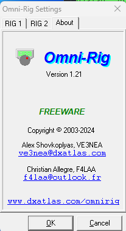

# OmnirigBiggerTimeout
This is a fork of OmniRig from VE3NEA that enable COM port timeout up to 20000ms instead of 4000ms. 
 
I had problems with OmniRig V1.20 because the timeout we can set in this version is limited to 4000ms. 
In my case, I am using a Magnetic Loop antenna situated 4m away from my TX,  
and I was getting many "Communication error" from WSJT-X program because of the HF fields produced by this nearby antenna. 
 
When that arise, I need to click on the "Retry" button in WSJTX error dialog, then reenable transmission by clicking "Enable-TX" button again. 
 
As when clicking "Retry", the communication was established again, I suspected that the "Timeout" of 4000ms was too short. 
 
I sent an email to VE3NEA to ask him if he could increase this limited value, but I got no reply. 
So, as this software is a "Freeware", and the sources are published on <a href="https://github.com/VE3NEA/OmniRig">github.com/VE3NEA/OmniRig</a>, 
I forked it, recompiled it using a <b>Delphi6 Pascal compiler</b> that I found on Internet, then I changed this 4000ms limit to 20000ms. 
 
I labelled this version <b>V1.21</b> 
 
And this solved my problem, as I was able to set the timeout to 8000ms, which is a value that worked for me. 
 
The <b>Omnirig.exe</b> file located in this project is the V1.21 version. 
To use it, you can simply replace the normal V1.20 Omnirig.exe installed by Omnirig legacy setup 
by this one in your <b>C:\Program Files (x86)\Afreet\OmniRig</b> directory. 
 
I do it using "rename" to get a backup of the original V1.20 .exe file. 
So, while no program using OmniRig is running (i.e: Log4OM closed, WSJT-X closed), 
in a CMD black window, I do: 
    <b><i>C:</i></b> 
    <b><i>CD "C:\Program Files (x86)\Afreet\OmniRig"</i></b> 
    <b><i>REN omnirig.exe omnirig.V120</i></b> 
    <b><i>COPY C:/users/\<username>/Downloads/omnirig.exe omnirig.exe</i></b> 
 
Then you can start Omnirig, and verify in the "About" section that you are running the V1.21 version. 

If yes, you can now set the "Timeout" value up to 20s. 
 
Note : A value greater than 4000ms will lose the beginning of the next frame, because your TX may stay in transmit mode during the next frame reception. So, avoid using a too much high value.  

